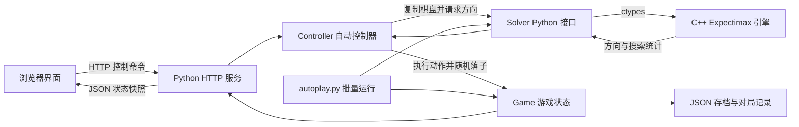
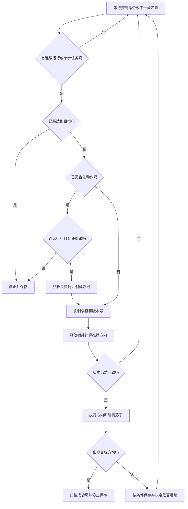

# 2048 自动挑战器：全部原理与实现逻辑

> 本文对照项目当前源码编写，解释程序实际做了什么、为什么这样实现，以及哪些能力还没有被验证。对应的运行代码基线为提交 `5ff8b0e`；本文是该基线的文档补充，不修改求解算法。
>
> 项目默认目标为 **65536**。目前已验证高位合并、自动控制和对局重放；已记录的三局完整测试分别达到 **16384、16384、8192**。支持目标方块的表示与搜索，不等于已经验证能够从空盘稳定达到目标。

## 阅读导航

以下目录使用标题自动生成的锚点。如果本地预览器不支持页内跳转，可在 [GitHub 在线阅读](https://github.com/bingingingin/2048-ai/blob/main/PRINCIPLES_AND_IMPLEMENTATION.md)中使用目录。

1. [项目解决什么问题](#1-项目解决什么问题)
2. [整体架构与文件分工](#2-整体架构与文件分工)
3. [2048 的规则与状态转移](#3-2048-的规则与状态转移)
4. [5 位等级编码与棋盘表示](#4-5-位等级编码与棋盘表示)
5. [行查表与四方向移动](#5-行查表与四方向移动)
6. [为什么使用 Expectimax](#6-为什么使用-expectimax)
7. [评估函数的全部组成](#7-评估函数的全部组成)
8. [递归搜索、概率与深度的准确含义](#8-递归搜索概率与深度的准确含义)
9. [非法方向、失败与目标达成的区别](#9-非法方向失败与目标达成的区别)
10. [迭代加深与时间预算](#10-迭代加深与时间预算)
11. [置换缓存与线程局部状态](#11-置换缓存与线程局部状态)
12. [C++ 与 Python 的调用边界](#12-c-与-python-的调用边界)
13. [自动运行控制器与并发逻辑](#13-自动运行控制器与并发逻辑)
14. [存档、随机种子与完整重放](#14-存档随机种子与完整重放)
15. [本地 HTTP 服务与接口](#15-本地-http-服务与接口)
16. [前端显示与交互逻辑](#16-前端显示与交互逻辑)
17. [无界面批量挑战](#17-无界面批量挑战)
18. [编译、启动与 Git 文件管理](#18-编译启动与-git-文件管理)
19. [一次完整决策的执行过程](#19-一次完整决策的执行过程)
20. [测试证据、限制与后续改进](#20-测试证据限制与后续改进)

## 1. 项目解决什么问题

2048 的困难不只是找到当前可以合并的方块。每次有效移动后，棋盘会随机出现一个 2 或 4。当前看起来得分较高的动作，可能把大方块推入内部，或者耗尽下一步需要的空间，导致稍后无法继续移动。

本项目采用的决策过程是：

1. 根据当前棋盘枚举上、下、左、右四个方向。
2. 排除无法改变棋盘的方向。
3. 对每个有效方向，考虑随后可能出现的新方块。
4. 继续模拟后续移动与落子，直到到达搜索边界。
5. 用评估函数判断边界棋盘的质量。
6. 把评估值沿搜索树向上传递，执行当前期望评分最高的方向。

它属于**基于规则模型和启发式函数的搜索程序**。当前没有训练神经网络，没有使用强化学习模型，也没有通过大量随机模拟轨迹来估计胜率。机会节点会枚举空格和 2、4 两种落子；较深、较低概率的路径则提前使用启发式估值。

浏览器中的游戏也是本项目提供的。当前版本没有读取其他网站棋盘、操纵其他网站按钮或者识别截图的适配器。

## 2. 整体架构与文件分工

项目把“决定怎么走”“真正执行游戏”“控制自动运行”“显示状态”分开实现。



| 文件 | 主要对象或函数 | 实际职责 |
| --- | --- | --- |
| [engine/solver.cpp](engine/solver.cpp) | `Board`、`Search`、`ai_choose()`、`ai_move()` | 编码、行查表、评估、搜索与原生接口 |
| [solver.py](solver.py) | `Solver`、`validate_board()` | 输入检查、数值与等级转换、调用动态库 |
| [game.py](game.py) | `slide()`、`Game` | 实际游戏规则、计分、随机落子和重放 |
| [server.py](server.py) | `Controller`、`Handler` | 自动运行线程、命令处理、存档和 HTTP 服务 |
| [autoplay.py](autoplay.py) | `run()`、`atomic_json()` | 批量挑战、输出摘要、写入 JSON 文件 |
| [build.py](build.py) | `build()` | 查找编译器、生成或复用动态库 |
| [verify_replay.py](verify_replay.py) | 命令行入口 | 调用重放逻辑，验证保存的对局 |
| [web/index.html](web/index.html) | 页面结构 | 棋盘、控制区、方向评分和历史列表 |
| [web/app.js](web/app.js) | `render()`、`command()`、`poll()` | 请求服务、刷新界面、处理键盘与滑动 |
| [web/style.css](web/style.css) | 样式与媒体查询 | 方块颜色、布局、动画和窄屏适配 |
| [tests/test_engine.py](tests/test_engine.py) | `EngineTests`、`ControllerTests` | 规则对照与自动控制回归 |
| [validation/summary.json](validation/summary.json) | 静态验证摘要 | 保存已完成批次的参数、结果与引擎指纹 |

这里有两份移动实现，但用途不同：C++ 移动用于大量搜索，Python 的 `slide()` 用于实际对局。二者通过测试相互对照，避免游戏执行器直接复用一个有问题的原生移动结果，造成“用同一个错误验证自己”。

## 3. 2048 的规则与状态转移

### 3.1 棋盘、分数和目标

Python 使用长度为 16 的列表保存棋盘，按行排列：

```text
索引：  0   1   2   3
        4   5   6   7
        8   9  10  11
       12  13  14  15
```

格子中的 `0` 表示空位，其他值为实际方块数值，例如 `2`、`1024`、`65536`。

`Game` 还保存 `score`、`moves`、`seed`、`target`、`history` 等状态。它们的含义分别是累计合并得分、有效移动次数、随机种子、目标方块和行动记录。

游戏胜利条件为：

$$
\max(B)\geq \text{target}
$$

失败条件是四个方向都不能改变棋盘。**棋盘已满不一定失败**：只要仍有能够合并的相邻方块，就可能继续移动。

### 3.2 一条线的移动顺序

`slide()` 对每一行或每一列执行以下过程：

1. 按移动方向读取四个格子。
2. 去掉空格，得到紧凑序列。
3. 从靠近移动方向的一端扫描，相邻相等方块合并。
4. 一旦合并，跳过这两个输入方块，保证新方块本轮不再次参与合并。
5. 在序列末尾补零，再写回对应位置。

例如向左移动：

```text
[2, 0, 2, 4] → 去零 [2, 2, 4] → 合并 [4, 4] → [4, 4, 0, 0]
[2, 2, 2, 2] → [4, 4, 0, 0]
[4, 4, 8, 0] → [8, 8, 0, 0]
```

最后一个例子本轮不会直接成为 `[16, 0, 0, 0]`，因为新合成的 8 不能在同一次移动中再次合并。

向右和向下时，先反转读取顺序。因此不是先固定从左到右合并、再随意翻转最终棋盘，而是始终从移动方向一侧开始处理。

### 3.3 得分如何增加

每次合并的得分等于新方块的值：`2 + 2 → 4` 增加 4 分，`32768 + 32768 → 65536` 增加 65536 分。一轮有多个合并时，将它们的新方块值相加。

实际游戏分数不等于棋盘所有方块之和。随机生成的 4 不直接贡献 4 分，只在后续参与合并时产生合并得分。

### 3.4 有效移动后才生成方块

`Game.step(direction)` 先调用 `slide()`，检查结果是否变化。如果没有变化，立即返回 `False`，不增加步数，不改变分数，也不消耗随机数。

有效移动时，程序依次更新棋盘、增加合并得分、增加步数，再生成新方块并记录本次行动。

若移动后有 $e$ 个空格，则对任一空格 $i$：

$$
P(i,2)=\frac{0.9}{e},\qquad P(i,4)=\frac{0.1}{e}
$$

实际实现先用 `rng.choice(empty)` 选空格，再用 `rng.random() < 0.9` 决定生成 2 还是 4。初始化时连续生成两次，因此初始两个方块不会占据同一格。

即使某次合并已经产生目标方块，`Game.step()` 也会按正常流程完成这次落子，再由控制器检查 `won` 并停止。随机落子不会删除已经出现的目标方块。

## 4. 5 位等级编码与棋盘表示

### 4.1 用等级表示 2 的幂

搜索引擎不直接存储 65536，而是存储它的指数，也称等级：

$$
r(v)=\begin{cases}
0,&v=0\\
\log_2v,&v>0
\end{cases}
$$

| 实际方块值 | 空格 | 2 | 4 | 2048 | 32768 | 65536 |
| --- | ---: | ---: | ---: | ---: | ---: | ---: |
| 内部等级 | 0 | 1 | 2 | 11 | 15 | 16 |

等级 0 被专门用于空格，因此接口不接受数值为 1 的方块。Python 使用整数的 `bit_length() - 1` 完成转换，无须调用浮点对数。

### 4.2 为什么不能继续使用每格 4 位

参考项目的实现使用每格 4 位，最多表示等级 15，也就是 32768。被核查的上游源码在两个等级 15 合并时保留等级 15，无法准确表示目标等级 16。

本项目改用每格 5 位，可表示等级 0–31，因此能正确表达：

```text
等级：15 + 15 → 16
数值：32768 + 32768 → 65536
```

这里只讨论上游已核查提交的实现，来源和版本见 [THIRD_PARTY_NOTICES.md](THIRD_PARTY_NOTICES.md)。

### 4.3 每行如何装入一个整数

四个格子共需要 20 位。若一行等级为 $r_0,r_1,r_2,r_3$，编码为：

$$
R=r_0+(r_1\ll5)+(r_2\ll10)+(r_3\ll15)
$$

读取第 $j$ 个格子使用：

```cpp
(R >> (5 * j)) & 31
```

其中 `31` 的二进制形式为 `11111`，用于保留最低 5 位。写入时先清空相应的 5 位，再把新的等级移到目标位置。

例如实际行 `[2, 0, 2, 4]` 对应等级 `[1, 0, 1, 2]`：

```text
编码 R = 1 + 0×32 + 1×1024 + 2×32768 = 66561
向左后等级为 [2, 2, 0, 0]，编码为 2 + 2×32 = 66
```

### 4.4 “80 位棋盘”不等于实际只占 10 字节

16 个格子的有效信息共为 $16\times5=80$ 位。但 `Board` 的实际成员为：

```cpp
uint32_t r[4]{};
```

也就是四个 32 位整数，共 **16 字节、128 位存储空间**。每行只使用低 20 位，高 12 位保持为零。这样可以直接以行编码索引查表数组，避免把 80 位信息紧密拼入跨整数结构所带来的操作复杂度。

### 4.5 当前接口的范围

Python 棋盘接口接受空格，或 `2` 到 `2**30` 的 2 的幂；目标参数接受 `4` 到 `2**30` 的 2 的幂。原生输入同样拒绝等级大于 30 的棋盘。

5 位本身能表示等级 31，但这不代表接口支持无限连续合并。如果外部调用者把两个 `2**30` 合并为 `2**31`，该输出已超出下一次调用接受的输入上限。查表在等级 31 处也不再继续合并。默认的 65536 目标远低于这个边界。

## 5. 行查表与四方向移动

### 5.1 用预计算替代重复处理

每格有 32 种等级编码，一条四格行共有：

$$
32^4=2^{20}=1,048,576
$$

种编码。程序在 `init()` 中遍历所有编码，为每一行预先计算三个结果：

| 表 | 元素类型 | 单项含义 | 数组数据大小 |
| --- | --- | --- | ---: |
| `lefts` | `uint32_t` | 该行向左移动后的完整行编码 | 4 MiB |
| `rights` | `uint32_t` | 该行向右移动后的完整行编码 | 4 MiB |
| `heuristics` | `double` | 该行的启发式评分 | 8 MiB |

三张表的数组数据合计约 **16 MiB**，不包含容器对象、缓存、Python 进程等其他内存开销。

这些表存的是最终行编码，不是上游某些实现使用的异或差分。搜索过程中直接执行 `row = table[row]` 即可得到移动结果。

### 5.2 如何建立左移表

预计算时仍使用完整规则：提取等级、压缩非零方块、从左向右合并、补零、重新编码。它只需对每一种行编码执行一次。

初始化还会提前计算等级 0–31 的四次方和 3.5 次方，用于构建评分表。进入搜索后，叶子评估主要变成数组访问，不再逐格反复调用 `pow()`。

### 5.3 右移表如何复用左移结果

`reverse()` 把四个 **5 位格子字段**逆序排列，而不是把整数的每个二进制位反转。

右移可以表示为：

$$
\operatorname{right}(R)=\operatorname{reverse}
\bigl(\operatorname{left}(\operatorname{reverse}(R))\bigr)
$$

因此在计算一行的左移结果时，也可以填入逆序行对应的右移结果。

### 5.4 上下移动为什么使用转置

转置把原来的列变成行：

```text
原棋盘索引        转置后索引
 0  1  2  3       0  4  8 12
 4  5  6  7       1  5  9 13
 8  9 10 11       2  6 10 14
12 13 14 15       3  7 11 15
```

于是四个方向统一为：

| 方向编号 | 字符串 | 引擎操作 |
| ---: | --- | --- |
| 0 | `up` | 转置 → 对四行左移 → 再转置 |
| 1 | `down` | 转置 → 对四行右移 → 再转置 |
| 2 | `left` | 对四行左移 |
| 3 | `right` | 对四行右移 |

移动前后的四个行整数完全相等，就说明这个方向无效。判断合法性不需要额外扫描每个方块。

### 5.5 初始化如何避免重复与竞态

原生接口进入时调用 `std::call_once(initialized, init)`。同一个动态库实例的行表只初始化一次；多个线程同时首次进入时，不会重复构建或读取尚未完成的表。初始化结束后，三张表用于只读查询。

## 6. 为什么使用 Expectimax

### 6.1 决策节点和机会节点

2048 有两种不同的状态转移：

- **玩家节点**：程序可以选择一个合法方向，因此取所有候选方向中的最大评分。
- **机会节点**：新方块随机产生，程序无法选择位置或数值，因此按概率求加权平均。

这与把随机落子当成恶意对手、总挑最坏落子的 Minimax 不同。Expectimax 使用游戏实际的概率规则评估后续局面。

### 6.2 状态需要区分动作前后

记 $B$ 为等待玩家移动的棋盘，$T_a(B)$ 为执行方向 $a$ 后、尚未生成新方块的棋盘。后者在一些文献中称为 afterstate，即动作后的状态。

再记 $S_{i,v}(B)$ 为在空格 $i$ 中生成数值 $v$ 后的棋盘。

如果只看一次机会展开，方向 $a$ 的评分形如：

$$
Q(B,a)=\frac{1}{e}\sum_{i\in E(T_a(B))}
\left[0.9\,V(S_{i,2}(T_a(B)))+
0.1\,V(S_{i,4}(T_a(B)))\right]
$$

其中 $E$ 是空格集合，$e$ 是空格数，$V$ 继续评估随后由玩家决策的局面。当前动作取合法方向中的最大值。

### 6.3 一个期望值例子

假设某次移动后只有两个空格，四种后继局面的评估值如下。这些是用于解释加权计算的示例数字，不是某次实际运行结果。

| 后继情况 | 概率 | 评估值 |
| --- | ---: | ---: |
| 空格 A 生成 2 | 0.45 | 100 |
| 空格 A 生成 4 | 0.05 | 80 |
| 空格 B 生成 2 | 0.45 | 60 |
| 空格 B 生成 4 | 0.05 | 20 |

这个方向的期望值为：

$$
0.45\times100+0.05\times80+0.45\times60+0.05\times20=77
$$

不能简单求四个评分的等权平均，因为生成 2 和 4 的概率不同。

### 6.4 优化的并不是精确获胜概率

完整搜索直到每一种未来都结束，计算代价过高。本项目在有限边界使用启发式函数替代真正的终局收益。

因此返回的是**当前评估体系下的近似期望效用**。它既不是精确的最终得分，也不是经过校准的“获胜概率 77%”。界面的方向数字只能在同一次决策中用于比较候选动作。

## 7. 评估函数的全部组成

### 7.1 总公式

对于等级序列为 $r_0,r_1,r_2,r_3$ 的一行，源码使用：

$$
h(R)=200000+270E+700M
-47\min(D_{\downarrow},D_{\uparrow})
-11\sum_{j=0}^{3}r_j^{3.5}
$$

整个棋盘的评分为四行和四列的评分之和：

$$
H(B)=\sum_{i=0}^{3}h(\operatorname{row}_i(B))
+\sum_{i=0}^{3}h(\operatorname{col}_i(B))
$$

以下分别解释每个量。

### 7.2 常数项：200000

每一行或列都有 200000 的基础值。它确定了普通棋盘评分的大致量级，也影响棋盘评估与终局惩罚的相对关系。

只比较两张普通叶子棋盘时，相同的常数项通常不会改变排序。但搜索树中还存在独立定义的失败和胜利效用，所以不能认为这一常数在整个决策系统里永远没有作用。

### 7.3 空格奖励：270E

$E$ 是该行的空格数。空位让小方块有移动和合并空间，也降低下一次落子直接堵死关键位置的风险。

整盘评分同时统计行和列，因此一个空格会被计入两次，对这一项的整盘贡献为 $2\times270=540$。

空格奖励并不意味着引擎永远选择空格最多的动作；它还要与单调性、合并潜力和未来随机落子后的评分综合比较。

### 7.4 相同等级连续段奖励：700M

这里的 $M$ **不是本轮实际发生的合并次数**。

程序忽略空格，读取非零等级序列。对长度至少为 2 的相同等级连续段，把这一段的长度加入 $M$。

| 实际行 | 去零后的实际值序列 | M |
| --- | --- | ---: |
| `[2, 0, 2, 4]` | `[2, 2, 4]` | 2 |
| `[2, 2, 2, 0]` | `[2, 2, 2]` | 3 |
| `[2, 2, 2, 2]` | `[2, 2, 2, 2]` | 4 |
| `[2, 2, 4, 4]` | `[2, 2, 4, 4]` | 4 |
| `[2, 4, 2, 0]` | `[2, 4, 2]` | 0 |

这个指标表示沿该方向压缩后，已有多少相同等级方块聚集在一起。它是合并潜力的近似特征，不是完整的未来合并计划。

### 7.5 单调性惩罚

定义相邻等级四次方的下降量和上升量：

$$
D_{\downarrow}=\sum_{j=1}^{3}
\max(r_{j-1}^{4}-r_j^{4},0)
$$

$$
D_{\uparrow}=\sum_{j=1}^{3}
\max(r_j^{4}-r_{j-1}^{4},0)
$$

惩罚取二者中的较小值。若一行完全递增或完全递减，其中一个量为零，单调性惩罚就是零。

例如等级 `[4, 3, 2, 1]` 是单调序列；`[4, 1, 3, 2]` 则有较大的中间折返。四次方会放大高等级方块之间的次序问题，使大牌排列对评分更敏感。

与合并潜力不同，单调性计算**保留空格的等级 0**，不先压缩序列。因此空格放在中间还是边缘，可能产生不同影响。

该特征能间接鼓励大方块靠近边缘，但源码没有“最大方块必须固定在左上角”的硬约束。每一行、每一列都独立比较增序和降序，也没有强制整盘遵循固定蛇形路径。

### 7.6 等级幂和惩罚

最后一项是 $-11\sum r_j^{3.5}$。它使用的是**等级的 3.5 次方**，不是实际方块数值的 3.5 次方。

这是一项与其他特征共同使用的经验评分。不能把它单独解释为“越大的方块越差”，也不能说它对每一次合并都会给出奖励。不同等级的合并会改变等级幂和，最后要看空格、连续段、单调性与目标奖励的综合结果。

它也不是累计游戏分数。搜索函数没有把 `Game.score` 作为输入，也没有在每次递归中直接累加 Python 游戏执行器返回的合并得分。

### 7.7 一条行评分的手算示例

取实际行 `[2, 0, 2, 4]`，等级为 `[1, 0, 1, 2]`：

```text
E = 1
M = 2
D↓ = 1
D↑ = 16
等级幂和 = 1 + 0 + 1 + 2^3.5 ≈ 13.3137085
```

代入公式：

$$
h(R)=200000+270+1400-47-11\times13.3137085
\approx201476.5492
$$

这只是其中一条行的评分。计算完整棋盘时，还要加上其他三行和四列。

### 7.8 系数来自哪里

上述评估结构和系数参考了 `nneonneo/2048-ai` 的实现，版权声明已保留。本项目没有声称这些系数经过针对 65536 的重新训练或大规模参数优化，也没有训练数据文件或模型权重。

## 8. 递归搜索、概率与深度的准确含义

### 8.1 两个递归函数

`Search::player()` 对应等待玩家动作的节点，`Search::chance()` 对应动作已执行、等待随机落子的节点。

下面的伪代码省略缓存、目标快捷路径和时间检查，用于展示递归关系：

```text
player(B, depth, p):
    best = 非法方向标记
    对每个方向 a:
        B2 = move(B, a)
        若 B2 != B:
            best = max(best, chance(B2, depth, p))
    若没有合法方向:
        返回 terminalLoss
    返回 best

chance(B, depth, p):
    若达到当前启用的目标判断条件:
        返回 WIN
    若 depth <= 0 或 p < cutoff:
        返回 H(B)
    找出 e 个空格
    result = 0
    对每个空格 i:
        result += 0.9 * player(在 i 放 2, depth - 1, p * 0.9 / e)
        result += 0.1 * player(在 i 放 4, depth - 1, p * 0.1 / e)
    返回 result / e
```

正常有效移动之后一定有可供新方块出现的空间。源码仍对机会节点没有空格的情况保留防御分支：不执行除零或凭空生成方块，而是进入下一玩家节点。

### 8.2 为什么既有 p，又有加权平均

`p` 是沿当前搜索路径累积的随机事件概率，用于判断是否继续展开；返回值则表示**已经到达当前节点后**的条件效用。

所以递归传入 `p * 0.9 / e`，并不代表要把返回值再乘一次完整路径概率。当前节点只按本层的 `0.9 / e` 和 `0.1 / e` 加权，祖先节点再负责自己的加权。

如果把累计概率 `p` 也重复乘进每个返回值，就会重复折算同一段随机路径，造成错误的期望值。

玩家选择方向时不将概率除以 4，因为四个方向不是等概率随机选择，而是由程序取最大值。

### 8.3 概率截断是什么

默认 `cutoff = 0.0001`。如果一条路径的累计概率低于该阈值，`chance()` 不再继续展开，而是返回当前棋盘的 `H(B)`。

这条路径没有被删除，也没有被当成零分；它仍通过上层机会节点的权重参与期望值，只是其更深的未来被启发式估值替代。

例如连续两次都在 10 个空格之一出现 4，某条确定位置路径的概率为：

$$
\frac{0.1}{10}\times\frac{0.1}{10}=0.0001
$$

源码采用严格小于号 `p < cutoff`。在数学上恰好等于阈值时不会仅因这一条件截断；程序实际比较的是浮点数值。

这是一种计算量控制方法，不是具有给定全局误差上界的精确剪枝。许多单独概率很小的路径仍可能有不小的累计影响。

### 8.4 搜索深度到底数什么

一次根决策先模拟当前玩家动作，然后调用：

```cpp
chance(after_move, depth, 1.0)
```

深度是在机会节点生成方块、转入玩家节点时减 1；玩家节点再选择方向时，不额外减一次。

因此，在没有提前截断的情况下：

| 报告深度 | 当前动作之后进一步考虑的内容 |
| ---: | --- |
| 0 | 直接评估当前动作后的棋盘，属于基础兜底 |
| 1 | 一次随机落子，再选择一次后续玩家动作，然后评估 |
| 2 | 两次随机落子，各自之后选择玩家动作，再评估 |
| N | 最多 N 轮“随机落子 → 玩家动作” |

例如深度 1 的路径是：

```text
当前棋盘 → 当前方向 → 新方块 → 下一次方向 → 叶子评分
```

所以不能把 UI 的“完整搜索 8 层”理解为八次完整枚举所有分支的独立按键，也不能理解成无截断的八层传统 Minimax 树。它表示该深度参数的一轮候选方向评估完成了，但低概率分支可能更早终止。

### 8.5 搜索为什么会迅速变大

一个玩家节点最多有 4 个有效动作；一个有 $e$ 个空格的机会节点有 $2e$ 种落子。一次组合展开的粗略分支规模可达到 $4\times2e$。

以每层空格数近似固定来估计，深度增加带来的开销类似 $O((8e)^d)$。真实棋盘中空格数和合法动作数不断变化，还受到截断、缓存、终局和预算约束，因此这不是精确运行时间公式。

行查表降低单次状态转移的成本，概率截断减少深层展开，缓存复用相同子问题，时间预算控制一次决策的总投入。

## 9. 非法方向、失败与目标达成的区别

### 9.1 非法方向：LOSS

源码中的 `LOSS = -1e12` 首先是一个无效方向标记和最大值搜索的初始值。不能改变棋盘的方向不会成为正常候选动作。

Python 接口把这些方向的评分转换成 `None`，前端显示“不可移动”。如果根棋盘完全没有合法动作，`ai_choose()` 返回 `-1`，Python 转换为 `direction=None`。

### 9.2 搜索分支走到失败：terminalLoss

某个随机分支在后续玩家节点没有任何合法动作时，返回的是 `terminalLoss`，而不是直接返回非法方向标记。

每次根搜索设置：

$$
\text{terminalLoss}=\min(0,H(B_{\text{root}})-1600000)
$$

它在本次搜索中固定，目的是让终局效用与普通棋盘评分保持较接近的数量级，同时允许高等级棋盘出现负评分。

若把 `-1e12` 直接当成终局效用，那么即使死亡分支的权重只有 $10^{-4}$，它也会贡献约 $-10^8$，足以压过普通棋盘约 $10^6$ 量级的结构评分。这样程序很容易被微小的近期死亡风险支配。

当前区分这两个概念，是对效用尺度的工程处理，不是经过校准的生存概率模型，也没有证明它在任意高等级棋盘上都是最优的风险偏好。

### 9.3 达成目标：WIN

`WIN = 1e12` 为目标达成效用。它使能够到达目标的路径优先于普通结构评分。

为减少常规阶段逐格检查目标的开销，程序在根棋盘存在至少 `targetRank - 2` 的方块时才启用 `checkGoal`。默认目标等级为 16，因此根棋盘出现等级至少 14，即 16384 时，启用这条搜索内目标判断。

这是当前实现的具体启用条件，不是“低于 16384 就数学上不可能在多步内到达目标”的证明。未启用时，搜索主要依靠普通启发式函数推进。

### 9.4 当前动作能直接达标时

根节点的基础扫描先检查移动后的棋盘。如果某个有效方向能够立即产生目标方块，直接返回该方向，不再进行昂贵的迭代搜索。

这一快捷路径按 `up → down → left → right` 的顺序返回第一个发现的达标方向；它没有必要继续评估其他同样达标方向的长期优劣。

该路径的统计数组被设为零。因此它的 `depth=0`、`nodes=0`、`elapsed_ms=0` 表示走了目标快捷路径，并不表示整个函数从加载、初始化到返回真的没有任何耗时。其余方向也可能只保留基础估值，而非完整期望评分。

实际是否停止游戏仍由 `Game.won` 和调用方控制。`Solver.choose()` 的 `None` 表示无合法方向，不是通用的“目标已达成”标记；外部接入时应自行先检查目标条件。

## 10. 迭代加深与时间预算

### 10.1 先获得可靠的基础答案

程序先计算四个方向的即时移动结果，用 `H()` 给合法方向评分，保留其中最好的一个。这个阶段不展开未来随机落子。

这样即使后面的搜索很快耗尽预算，也有一个经过合法性检查的动作可返回。

### 10.2 从浅到深逐轮搜索

随后从深度 1 开始，一直尝试到 `max_depth`。每一轮都评估根棋盘的全部方向，结果先写入临时数组 `round`。

只有本轮全部方向评估结束，才把 `round` 替换为正式结果，同时更新推荐方向和 `completed` 深度。

如果深度 5 搜索到第三个方向时超时，程序会丢弃整轮深度 5 的候选评分，继续使用已完成的深度 4 结果。它不会把前三个深度 5 评分和第四个深度 4 评分混合比较。

这一机制减少了超时对先搜索方向的偏向，但不是完整意义上的“完全不受顺序影响”：相等评分的选择仍按扫描顺序保留，缓存替换和时间预算也会影响实际完成的深度。

### 10.3 时间检查的粒度

`tick()` 在每次进入 `chance()` 时增加节点计数，每累计 1024 次进行一次时钟检查，超过截止时间就抛出内部 `Timeout` 异常，交给根搜索处理。

因此思考时间是**软预算**：不是到达 100.000 ms 就立即终止所有机器指令。线程调度、检查间隔和基础工作都可能让耗时稍微超出配置值。

一次调用也可能提前结束，例如已经完成最大深度，或者发现立即达标动作。更大的预算是允许更多计算，不是强制休眠到该时间。

行表首次初始化发生在搜索计时起点之前，`elapsed_ms` 不包含这部分首次初始化成本；它也不包含 Python 侧校验、JSON 传输或页面绘制。

### 10.4 搜索统计如何理解

| 字段 | 准确含义 |
| --- | --- |
| `direction` | 本次推荐的合法方向；无合法方向时为 `None` |
| `values` | 最后一轮完成的方向评分；未完成任何轮时为基础评分 |
| `depth` | 完成的最高深度参数，不是每条路径实际达到的深度 |
| `nodes` | 本次调用进入 `chance()` 的累计次数 |
| `cache_hits` | 本次调用的缓存命中次数 |
| `elapsed_ms` | 原生搜索阶段报告的毫秒数 |

节点数包含多轮迭代，以及最后被放弃的不完整轮次；它不是唯一棋盘数，也不是实际游戏走过的步数。

### 10.5 三种界面档位

| 模式 | 每步软预算 | 最大深度参数 | 概率阈值 |
| --- | ---: | ---: | ---: |
| 快速 `fast` | 10 ms | 5 | 0.0001 |
| 均衡 `balanced` | 100 ms | 8 | 0.0001 |
| 深思 `deep` | 500 ms | 10 | 0.00003 |

深思模式同时增加预算和深度上限、降低截断阈值。它允许展开更多路径，但当前没有足够的完整对局统计证明其达到 65536 的成功率。

## 11. 置换缓存与线程局部状态

### 11.1 为什么会遇到相同子问题

不同的移动与落子顺序可能到达相同棋盘。若之后的搜索条件也一致，就可以复用先前算出的值，减少重复计算。

本项目缓存的是 `chance()` 节点的评估结果，没有给每个 `player()` 调用单独建表。

### 11.2 缓存结构

`Search` 为缓存分配 $2^{18}=262,144$ 个固定槽位。每项 `Entry` 保存：

- 完整 `Board`；
- 评估值 `value`；
- 调用代号 `generation`；
- 剩余 `depth`；
- 累计概率的 64 位浮点位模式 `probability`。

缓存内存量为 `262144 × sizeof(Entry)`，再加上容器开销。不能只把每项当成一个 8 字节分数，因为棋盘、条件和对齐填充也占空间。

### 11.3 为什么不能只使用棋盘作为键

相同棋盘若剩余深度不同，可能得到不同的搜索结果。相同棋盘若沿路径累计的概率不同，也可能在不同位置触发概率截断。

因此当前实现要求棋盘、剩余深度和累计概率都匹配。概率通过复制 `double` 的原始位模式存入 `uint64_t`，不进行小数位四舍五入或粗略分桶。

严格匹配可能减少命中率，但避免把截断条件不同的子问题误当成同一个问题。

### 11.4 哈希冲突如何处理

程序把两组行编码、概率位模式和深度混合计算哈希，再用：

```cpp
h & (cache.size() - 1)
```

定位一个槽位。查到槽位后还要逐项比较完整键，不能仅凭哈希相等就认定命中。

碰撞会导致旧槽位被新结果覆盖，降低缓存效率；完整键的二次核对避免把不同棋盘的结果误取出来。

这是一张直接映射的固定大小表，不是会无限增长的 `unordered_map`，也没有 LRU 链表。它没有做旋转、镜像等棋盘对称归一化。

### 11.5 generation 为什么必要

每次 `ai_choose()` 增加一次 `generation`。缓存项必须属于当前代号才有效。因此同一根决策里的不同方向和迭代轮次可以复用匹配子问题，但下一次实际游戏决策不会直接沿用上一轮缓存的有效性。

这样也避免复用不同根棋盘 `terminalLoss`、目标配置或搜索参数下的旧值。代号回绕为零时，程序会重置缓存项代号。

### 11.6 thread_local 与并行能力边界

`thread_local Search search` 表示每个实际调用线程有自己的搜索状态和缓存，行查表则在动态库内共享只读数据。

这不表示当前一次决策把四个方向分配给四个 CPU 核。当前方向循环是串行的，网页控制器只有一个 AI 工作线程。多线程 HTTP 服务负责响应请求，不能据此声称搜索引擎已实现多核并行加速。

## 12. C++ 与 Python 的调用边界

### 12.1 为什么使用原生动态库

搜索需要重复执行大量小规模移动、比较和查表，适合由 C++ 处理。Python 负责游戏状态、线程协调、文件和 HTTP，便于维护。

`Solver` 使用标准库 `ctypes.CDLL` 加载动态库，因此不需要把整个游戏写成 C++ 应用，也不需要安装额外的 Python 扩展包。

### 12.2 两个原生接口

接口通过 `extern "C"` 导出，Windows 下再使用 `__declspec(dllexport)`：

```cpp
int ai_move(const uint8_t* cells, int direction, uint8_t* output);

int ai_choose(const uint8_t* cells,
              int budget_ms,
              int max_depth,
              double cutoff,
              int target_rank,
              double* values,
              uint64_t* stats);
```

传入的 `cells` 是 16 个等级，而不是 16 个实际方块数值。`values` 长度为 4，`stats` 长度为 4，均由 Python 分配连续数组后传入。

`ai_move()` 返回是否发生变化；`ai_choose()` 返回方向编号。Python 用 `argtypes` 和 `restype` 明确声明参数与返回类型，避免依赖 ctypes 的默认解释。

### 12.3 输入验证

Python 会检查棋盘必须是长度 16 的列表或元组，每个元素必须是整数、非负，并处于接口支持范围。

对非零数值，通过：

```python
v & (v - 1)
```

是否为零判断它是不是 2 的幂，同时单独排除 1。代码使用 `type(v) is int`，因此不会把 Python 中可表现为整数的 `True` 当成合法方块。

时间预算须为 1–60000 的整数毫秒，深度须为 1–12 的整数，概率阈值须为有限数且在 `1e-8` 到 `0.01` 之间。

### 12.4 调用返回什么

```python
from solver import Solver

solver = Solver()
board = [
    2, 4, 8, 16,
    0, 2, 4, 8,
    0, 0, 2, 4,
    0, 0, 0, 2,
]
decision = solver.choose(board, budget_ms=100, max_depth=8, target=65536)

if decision['direction'] is not None:
    print(decision['direction'])
    print(decision['values'])
    print(decision['depth'], decision['nodes'], decision['elapsed_ms'])
```

这个调用只返回建议，不改变输入列表，也不生成实际新方块。外部游戏必须自行执行方向、识别真实落子，再把更新后的棋盘用于下一次请求。

`Solver.move()` 同样只负责确定性的移动与合并，不生成随机方块，也不返回合并得分。实际游戏需要得分时使用 `game.slide()` 或自己的规则实现。

## 13. 自动运行控制器与并发逻辑

### 13.1 自动运行在服务端

浏览器只发送开始、暂停等命令，真正的自动循环位于 `Controller.loop()` 的后台线程。只要 Python 服务继续运行，即使网页切到后台或关闭标签，自动对局仍可继续。

进程关闭、机器休眠等情况并不会由浏览器替它继续计算。当前也没有系统级常驻服务或开机自启任务。

### 13.2 控制器的重要变量

| 变量 | 作用 |
| --- | --- |
| `running` | 是否持续自动运行 |
| `thinking` | 工作线程是否正在求解某个快照 |
| `steps` | 等待执行的 AI 单步数；正常单步命令设为 1 |
| `revision` | 控制状态版本，用于丢弃旧搜索结果 |
| `profile` | 当前思考档位 |
| `retry` | 失败后是否自动新开一局 |
| `attempt` | 当前局次计数，手动重开也会增加 |
| `best` | 已记录的最大方块 |
| `analysis` | 最近一次已采用的搜索结果 |
| `error` | 当前错误说明 |

工作线程用 `threading.Event` 等待唤醒。没有任务时最多等待 0.2 秒再检查，避免空转。持续运行时，一步结束会再次设置事件，让下一轮尽快开始，不是每一步固定停顿 0.2 秒。

### 13.3 计算时为什么不能一直持锁

控制器使用 `threading.RLock` 保护共享状态。HTTP 请求和 AI 工作线程都可能读取或修改棋盘，因此需要互斥。

但一次深思可能持续数百毫秒。如果整个搜索期间都持有锁，暂停命令和状态查询也会被阻塞。

当前采用三段式流程：

```text
持锁：复制棋盘，记录 revision 和参数，设置 thinking
解锁：调用 Solver.choose() 完成原生搜索
持锁：检查 revision 是否仍相同，决定是否采用结果
```

`RLock` 允许同一个线程重入。例如命令处理已经持锁时，再调用也会加锁的 `state()`，不会因此把自己锁死。

### 13.4 暂停如何阻止旧结果执行

假设工作线程拿到版本 12 的棋盘并开始搜索。此时用户按下暂停，控制器清除 `running` 与 `steps`，把 `revision` 增加为 13，并保存状态。

原生搜索不会被强制终止；它会在自己的预算内结束。回来后发现版本 12 已经过期，于是丢弃方向，不对棋盘执行这一步。

因此“暂停后不再落子”靠的是版本核对，而不是危险地中断 C++ 正在执行的机器代码。暂停后 `thinking` 仍可能短暂为真，直到在途调用结束。

手动移动、重开、修改设置也会更新版本，防止旧棋盘或旧参数下的结果覆盖新状态。

### 13.5 命令行为

| 命令 | 控制器行为 |
| --- | --- |
| `start` | 开启持续运行；已达目标时不继续启动 |
| `pause` | 清除连续运行和待执行单步，更新版本并保存 |
| `step` | 在可以操作时请求一次 AI 决策，执行后回到暂停 |
| `move` | 停止自动运行，由用户方向执行一次实际移动 |
| `new` | 归档当前对局，生成新游戏，增加局次，保持暂停 |
| `settings` | 更新档位或重试开关，更新版本并保存 |

设置中的 `retry=true` 不会单独启动游戏。只有处于自动运行状态且遇到失败时，工作线程才会自动新开一局。

### 13.6 自动循环的状态流



搜索错误、返回非法动作等异常会使控制器停止运行并记录错误。它不会在仍有合法移动时，把求解器意外返回 `None` 静默当成正常失败。

## 14. 存档、随机种子与完整重放

### 14.1 每局使用独立随机数生成器

`Game` 创建自己的 `random.Random(seed)`。如果用户没有指定种子，先通过 `SystemRandom()` 获取一个 32 位范围内的种子，再用它建立这一局的随机序列。

求解器只接收当前棋盘和搜索参数，不接收 `rng`，也不接收该局种子。它不能利用种子预知下一块实际出现在哪里。

### 14.2 历史记录保存什么

`Game.export()` 输出的结构包括：

| 字段 | 内容 |
| --- | --- |
| `version` | 当前格式标识，为 1 |
| `seed`、`target` | 本局随机种子与目标 |
| `initial` | 两次初始落子后的棋盘 |
| `board` | 导出时的最终棋盘 |
| `score`、`moves` | 分数与有效移动数 |
| `max_tile`、`won`、`over` | 结果派生状态 |
| `history` | 每次有效方向及该步生成的新方块 |

一条历史记录形如：

```json
{"direction": "left", "spawn": {"index": 9, "value": 2}}
```

它记录的是实际发生的动作和落子，不包含搜索树、每个节点评分或每一步的所有候选结果。

### 14.3 恢复不是直接相信最后一张棋盘

`Game.restore()` 的过程为：

1. 使用记录中的种子重新创建游戏。
2. 检查生成的初始棋盘与 `initial` 一致。
3. 按顺序执行每条方向记录。
4. 检查动作有效，并核对重新生成的落子与保存的落子完全一致。
5. 重放结束后，检查棋盘、分数、步数、最大方块及终局标记。

恢复依靠同样顺序的随机调用重建 RNG 状态，没有单独序列化 `random.getstate()`。因此恢复后继续玩，也能延续已经重放到的位置。

这既是一种恢复方法，也是一种一致性验证方法。当前 `version` 被导出，但恢复函数没有据此做显式版本分派；以后修改格式或随机规则，需要补充迁移逻辑。跨 Python 版本的完全一致性也不应超出当前测试环境作保证。

### 14.4 为什么同一个种子重新求解可能走出不同对局

落子序列还取决于每一步棋盘有哪些空位。只要某次 AI 决策改变，后续对同一个随机数的解释就可能落在不同格子。

AI 使用时间预算，机器负载会影响完成的搜索深度，因此相同种子和相同参数重新从头求解，不一定得到相同方向序列。

应区分：

- **重跑求解器**：重新计算方向，可能受时间预算影响。
- **重放已保存记录**：按照保存的方向执行并核对落子，可以精确检查该份轨迹。

### 14.5 网页服务何时保存

实时模式在以下时机写入 `runs/live/session.json`：

- 自动运行每 50 步；
- 暂停、设置变更、手动移动或重开；
- AI 单步完成；
- 自动运行中遇到终局或达到目标；
- 正常执行关闭清理时。

因此在最近一次成功保存之后异常中断，自动运行阶段通常最多损失尚未保存的 49 个有效步骤。写盘失败、设备故障等情况不能用这个步数作严格保证。

自动失败重试、手动重开、AI 达标时，会将对局归档为 `game-<种子>-<时间戳>.json`。若关闭自动重试，失败局仍保存在当前 session 中；并不是每次失败都会立即单独生成一份归档文件。

服务恢复后刻意保持暂停，避免打开服务就立即改变已恢复的棋盘。异常存档会被改名保留，控制器记录错误，而不是直接把无法恢复的内容当成正常棋盘。

### 14.6 为什么使用临时文件替换

`atomic_json()` 先把 JSON 写到同目录的 `.tmp` 文件，再用 `Path.replace()` 替换目标文件。这能减少直接覆盖时只留下半个 JSON 文件的风险。

当前没有额外执行 `fsync` 或完整的断电持久性协议，因此不能把这称为对所有磁盘、断电场景都可靠的事务数据库。

### 14.7 存档的时间和空间开销

历史列表会随有效步数线性增长，空间复杂度约为 $O(n)$。保存时会重新序列化整个历史，恢复时会逐步重放，所以两者也都需要约 $O(n)$ 的工作。

界面显示的 `elapsed` 是该局累计的墙钟经过时间，包含暂停期间；不是只统计 C++ 搜索耗时的 CPU 时间。

## 15. 本地 HTTP 服务与接口

### 15.1 为什么需要 Python 服务

普通网页脚本不能直接加载这个本地 C++ 动态库。浏览器通过 HTTP 与 Python 通信，再由 Python 调用动态库。

当前使用标准库 `ThreadingHTTPServer`，监听 `127.0.0.1`，默认端口 2048。它是本机服务，不是已经部署到互联网的多人游戏后端。同一个服务实例上的多个标签页共享同一个 `Controller` 和同一局游戏。

### 15.2 读取接口

| 请求 | 返回内容 |
| --- | --- |
| `GET /api/state` | 当前棋盘、控制状态、搜索统计、最近对局摘要 |
| `GET /api/replay` | 当前局完整 `Game.export()` 结果 |
| `GET /` | HTML 页面 |
| `GET /app.js` | 前端脚本 |
| `GET /style.css` | 样式 |
| `GET /favicon.svg` | 图标 |

静态文件采用固定路径列表，没有把项目根目录作为任意文件下载目录。`/api/state` 不传完整历史，避免每次轮询都发送不断增长的对局记录。

### 15.3 控制接口

所有控制命令都使用 `POST`，请求体为 JSON 对象，即使无参数也传 `{}`。

| 请求 | 请求体示例 |
| --- | --- |
| `POST /api/start` | `{}` |
| `POST /api/pause` | `{}` |
| `POST /api/step` | `{}` |
| `POST /api/move` | `{"direction":"left"}` |
| `POST /api/new` | `{}` 或 `{"seed":65536}` |
| `POST /api/settings` | `{"profile":"deep","retry":true}` |

命令成功后直接返回一份新状态，浏览器不用再等待下一轮状态轮询才更新按钮。

当前 HTTP 层没有暴露一个让任意外部棋盘直接获得 AI 推荐的 `/api/solve` 接口。要分析自己的棋盘，使用 Python `Solver.choose()`；要提供通用远程接口，需要另行实现。

### 15.4 请求与响应处理

控制请求要求 `Content-Type: application/json`，请求体长度为 1–4096 字节。如果提供 `Origin`，它必须匹配本服务端口的 `localhost` 或 `127.0.0.1` 地址；没有 Origin 的本地命令行请求也可以调用。

响应设置 `Cache-Control: no-store`，避免棋盘状态被浏览器缓存；设置 `X-Content-Type-Options: nosniff`，并根据静态文件类型返回 MIME 类型。

这些是当前本机工具的接口边界，不构成互联网服务的身份认证、账户隔离或完整部署方案。

## 16. 前端显示与交互逻辑

### 16.1 前端不独立维护游戏规则

`app.js` 初始化 16 个格子元素，随后根据服务端 `board` 更新文字和样式。前端不自行合并方块，也不生成随机数决定下一块。

这样网页里的显示结果与 Python 的真实游戏状态来自同一份数据，不会出现浏览器和后端各玩一局再尝试同步的问题。

### 16.2 定时轮询

`poll()` 请求 `/api/state`，在本轮结束后用 `setTimeout(poll, 250)` 安排下一次。因此实际轮询间隔是请求耗时再加约 250 ms，不是严格固定的每秒四次。

如果引擎一秒执行很多步，界面会显示较新的棋盘快照，不会为每一步排队播放动画。搜索速度不受“必须显示每一帧”的限制。

当前没有使用 WebSocket、服务端推送或逐步动画队列。

### 16.3 避免旧轮询覆盖新命令

前端使用两个变量：

- `pending`：当前是否有控制请求在等待，防止快速连点并发发送多个命令。
- `commandEpoch`：每次新命令都会增加的本地版本号。

轮询发出前记录 `commandEpoch`。如果轮询过程中用户又发送了命令，旧请求返回时就不会拿旧状态覆盖新命令的显示结果。

这与后端的 `revision` 解决的是不同问题：前端版本保护屏幕上的新状态，后端版本保护真正执行到棋盘上的动作。

### 16.4 方向评分属于哪一张棋盘

控制器先搜索旧棋盘、执行推荐动作，再把新棋盘和刚才的 `analysis` 一起返回。

因此方向评分解释的是**刚刚执行的那一步**，不一定对应屏幕上更新后棋盘的下一步可行性。页面说明也明确写为“上一步各方向的期望评分”。

非法方向显示“不可移动”，推荐方向高亮；值达到 `WIN` 时显示“达成目标”。这些数字不用于换算成百分比胜率。

### 16.5 键盘和滑动

方向键发送手动移动命令，同时由后端停止自动运行。空格切换开始和暂停；焦点在输入框、下拉框等编辑元素时不拦截这些按键。

滑动使用 Pointer Events：记录按下位置，在抬起时比较横纵位移。主方向位移不足 25 px 时忽略，否则按位移较大的轴确定方向。取消事件会清除起点。

### 16.6 对局下载

点击导出时，前端请求 `/api/replay`，把返回 JSON 创建为 `Blob`，生成临时对象 URL，再触发浏览器下载。下载动作之后释放对象 URL。

导出文件与服务端 session 的区别是：下载文件主要是单局 `Game.export()`，而 session 还包含控制器档位、重试开关和历史摘要等附加状态。

### 16.7 布局与动画

棋盘使用 CSS Grid 固定为四列，并保持正方形。方块按数值设置背景色，较大的数值使用较小字号，以容纳五位数目标方块。

状态刷新时比较当前格子与上一份快照，发生变化的非空格子应用短缩放动画。它是快照变化反馈，不是精确追踪每一块在棋盘中的移动轨迹。

页面通过媒体查询在窄屏切换为单列布局，使用 `prefers-reduced-motion` 关闭不必要的动画；所有样式和图标均由本项目静态文件提供，没有外部前端框架或运行时字体下载依赖。

## 17. 无界面批量挑战

### 17.1 与网页模式共用什么

`autoplay.py` 同样使用 `Solver` 和 `Game`，因此与网页模式共享引擎和实际游戏规则。它没有启动 HTTP 服务，也不需要打开浏览器。

### 17.2 外层和内层循环

外层循环负责对局数量，第 $k$ 局使用 `args.seed + k`，其中 $k$ 从 0 开始。内层循环在未达标、未失败且未超过步数上限时，反复求解并执行推荐方向。

每 1000 个有效步骤打印一次进度，并保存当前局文件。每局结束后再次保存完整对局，更新 `summary.json`。

网页重试时新建 `Game()`，随机获取种子；命令行批次使用递增的指定种子。二者规则相同，但种子管理方式不同。

### 17.3 停止条件与参数

```powershell
# 有限批次
python autoplay.py --games 10 --seed 65536 --budget-ms 100

# 持续挑战，首局达标后结束整个批次
python autoplay.py --games 0 --until-target --budget-ms 500 --depth 10 --cutoff 0.00003

# 较小目标的功能验证
python autoplay.py --games 1 --target 2048 --budget-ms 10 --output runs/quick
```

`--games 0` 表示不限局数。每一局达到目标都会结束该局；`--until-target` 决定是否也结束整个批次。没有这个参数时，程序可以记录一局成功，再继续下一个种子。

默认单局最多 200000 个有效步骤，结果标记可能为 `won`、`lost`、`move_limit` 或正常捕获中断时的 `interrupted`。

当前批量运行是串行的，没有多进程并行、自动训练或根据前几局结果调整评估系数的机制。

### 17.4 文件覆盖与恢复边界

每局文件按种子命名，同一输出目录重复运行同一种子可能覆盖旧记录；摘要也是当前这次运行的结果列表。因此不同实验应使用不同 `--output`。

命令行脚本会保存进度，但没有 `--resume` 参数自动读取已有文件继续批次。实时网页服务具备 session 恢复逻辑，二者不能混为一谈。

正常捕获 `KeyboardInterrupt` 时，批量脚本会保存当前局再退出；强制杀进程或断电不一定能进入这段处理。

## 18. 编译、启动与 Git 文件管理

### 18.1 动态库如何产生

`build.py` 先检查动态库是否存在，并比较它与 `engine/solver.cpp` 的修改时间。如果动态库不旧于源码且没有指定 `--force`，就直接复用。

需要编译时，依次选择环境变量 `CXX`、PATH 中的 `g++`、PATH 中的 `clang++`。基本选项为：

```text
-O3 -std=c++17 -shared
```

Windows 输出 `build/solver.dll`，并添加静态运行库相关选项。其他平台分支输出 `build/libsolver.so`，添加 `-fPIC -pthread`。

当前实际验证环境是 Windows / MinGW-w64。其他平台存在构建分支，不代表已经逐一完成实测；当前脚本也不是 MSVC 的 `cl.exe` 工程生成器。

缓存构建只比较源码修改时间，不会自动追踪所有编译器版本和编译选项变化。如果修改构建选项或更换编译器，应主动强制重编译。

### 18.2 启动顺序

```text
start.cmd 切换到脚本所在目录
    → python server.py
    → 创建 Controller
    → 创建 Solver，必要时编译并加载动态库
    → 尝试恢复 session
    → 启动 AI 工作线程
    → 建立本地 HTTP 服务并等待请求
```

加载库与初始化全部查表不是同一件事：行表在首次调用原生接口时通过 `call_once` 构建。

正常退出路径会调用 `Controller.close()`，设置停止标志、让在途结果失效、保存状态，并等待工作线程结束。

### 18.3 哪些文件进入公开仓库

Git 保留源码、网页、说明文档、测试和静态验证摘要。`.gitignore` 排除：

```text
build/          本地编译产物
runs/           实时存档和完整运行记录
__pycache__/    Python 字节码缓存
*.pyc
.reference/     临时参考源码
.venv/          本地虚拟环境
```

`.gitattributes` 为普通文本采用 LF，为 `.cmd` 文件采用 CRLF，减少不同系统检出时的换行差异。

第三方来源、核查提交和 MIT 许可原文放在 `THIRD_PARTY_NOTICES.md`。参考项目的代码和思想归属与本项目新增实现的分工不能因为仓库公开就省略。

## 19. 一次完整决策的执行过程

以网页已经开始自动运行为例，把前面的各层连接起来：

1. **取得当前状态**：工作线程持锁，复制 16 格棋盘、当前版本号和档位参数。
2. **离开共享状态区**：设置正在思考，然后释放控制器锁。
3. **转换输入**：Python 校验棋盘，把实际数值转为等级，生成连续的 ctypes 数组。
4. **进入原生引擎**：C++ 完成一次性查表初始化，编码为四个行整数，设置本次预算、代号和终局参数。
5. **构建基础候选**：用行查表生成四方向结果，排除无效方向；可立即达标时走快捷路径。
6. **展开迭代搜索**：从浅到深计算机会节点期望和玩家节点最大值，使用叶子评估、概率截断和缓存。
7. **确定返回结果**：遇到超时保留上一完整轮的答案，输出方向、评分和统计。
8. **重新核对版本**：Python 回到控制器锁内，确认搜索期间没有暂停、手动接管、重开或参数变更。
9. **执行真实动作**：通过 Python 游戏规则更新棋盘，累加实际合并得分，随机生成新方块，写入历史。
10. **处理状态与存档**：检查目标、失败、单步或连续运行条件，必要时保存或归档。
11. **更新界面**：浏览器下一次状态轮询拿到新棋盘和刚才采用的搜索结果，更新格子与方向评分。

这里真实的随机落子只发生在第 9 步。第 6 步只是对各种可能落子进行推演，不会偷偷替真实游戏选择更有利的位置。

## 20. 测试证据、限制与后续改进

### 20.1 规则正确性如何验证

当前测试的主要证据包括：

| 检查 | 覆盖内容 |
| --- | --- |
| 83,521 种行布局 | 等级 0–16 的全部四格组合，逐一检查原生左移与 Python 规则一致 |
| 1,500 个随机棋盘 × 四方向 | 共 6,000 次整盘移动对照，并检查移动前后方块总和守恒 |
| 高等级合并 | 四方向检查多个等级的相等方块合并，包含 32768 合成为 65536 |
| 规则边界 | 一轮不连锁合并、合并得分、无效动作不增加步数或消耗随机数 |
| 决策边界 | 无路可走返回空方向、超时仍返回合法动作、立即达标优先 |
| 自动控制 | 单步、暂停竞态、重启恢复、失败重试和目标停止 |
| 记录核对 | 种子、行动、落子、分数与最终棋盘的一致性 |

已经记录的回归结果为 **12 项测试通过**。本次文档编写没有修改运行代码，也没有把历史测试当成新一轮算法实验。

测试中直接放入两个 32768 的构造棋盘，只证明高位合并和停止逻辑，不证明 AI 能从初始两个小方块一路玩到 65536。

### 20.2 完整对局证据

已保存批次使用 10 ms 软预算、最大深度参数 8、阈值 0.0001：

| 种子 | 最大方块 | 分数 | 有效步数 | 耗时 |
| --- | ---: | ---: | ---: | ---: |
| 20260911 | 16384 | 387304 | 14904 | 152.86 s |
| 20260912 | 16384 | 367020 | 13961 | 144.28 s |
| 20260913 | 8192 | 134568 | 5687 | 58.42 s |

三局合计 34,552 个有效动作，均最终无合法移动，没有达到 65536。完整记录在生成它们的本地工作目录中逐步重放核验过，公开仓库保留摘要和源码指纹。

这三个指定种子不是足以评估总体成功率的样本，也不是网页“深思”模式的完成批次。更完整的说明见 [VALIDATION.md](VALIDATION.md)。

### 20.3 当前方法的能力边界

目前已经实现的是一个可运行、可暂停恢复、可追查轨迹的启发式挑战器。它仍然受到以下因素限制：

- **有限搜索范围**：时间、深度和概率截断共同限制了能看到的未来。
- **评估函数近似**：局部行列结构并不包含完整的远期合并计划。
- **目标效用尺度**：`WIN` 与终局惩罚是工程上的效用选择，不是经过校准的概率。
- **计算资源**：当前方向搜索串行，增大预算会增加整体对局耗时。
- **测试规模**：正确性回归较充分，但目标成功率的实证样本仍很少。
- **游戏接入范围**：当前控制自己的本地游戏，尚无第三方网页适配器。

### 20.4 如果继续提高 65536 表现，应先做什么

以下属于后续方向，**当前代码没有实现**：

1. **建立更完整的基准批次**：固定种子集合，分别统计 8192、16384、32768、65536 的到达情况与时间，区分开发种子和独立验证种子。
2. **让评估函数优化有证据**：在足够多对局上比较参数，而不是因一局得分高就认定新系数更强。
3. **研究资源分配**：根据空格数、方块等级或候选动作差距调节预算，并验证这种调节是否改善整局表现。
4. **增加搜索性能优化**：评估根方向并行、对称状态归一化或其他更高效缓存方式，注意保持截断条件和结果语义一致。
5. **研究专门的后期策略**：例如特定残局结构的策略或局部表库，但需要额外实现、数据和验证。
6. **评估学习型方法**：如果引入训练得到的价值函数，应补充模型来源、训练数据、泛化与独立测试，不能把现有手写启发式说成已经训练过的 AI。

任何改进都应同时检查规则与实际成绩。更快的节点搜索不必然意味着更高的 65536 到达率，单次出现更大方块也不足以证明整体策略已经改善。

### 20.5 建议的源码阅读顺序

先阅读 `game.py` 的确定性移动和落子，再看 `solver.py` 的输入输出；随后进入 `engine/solver.cpp`，按 `Board → init → move → heuristic → player/chance → ai_choose` 阅读；最后阅读 `Controller.loop()`、存档逻辑和 `web/app.js`。

这个顺序从实际规则进入搜索，再连接自动运行系统，可以明确分清“游戏真实发生了什么”和“AI 在决策时推演了什么”。
